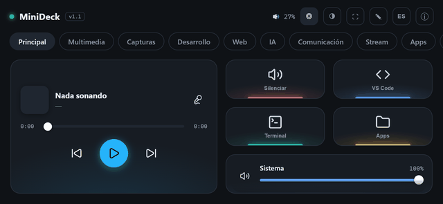
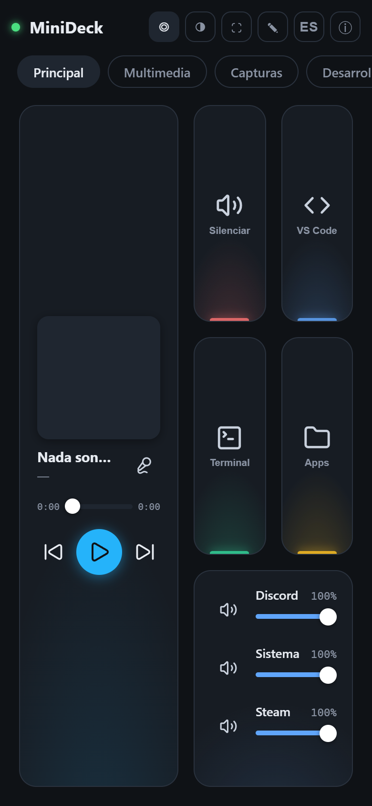
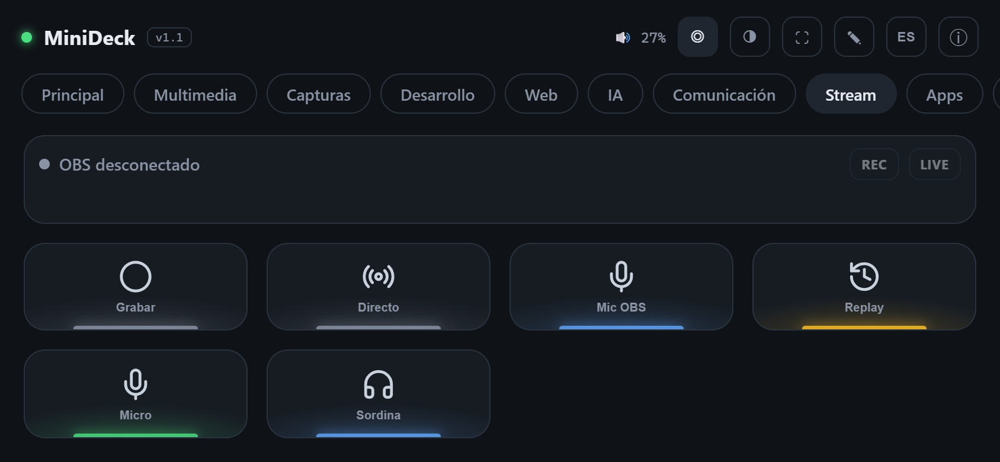
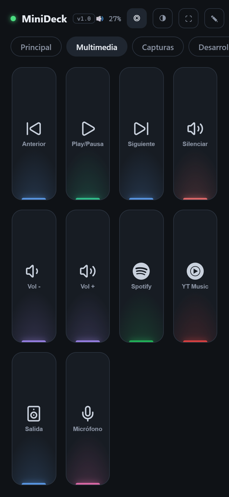
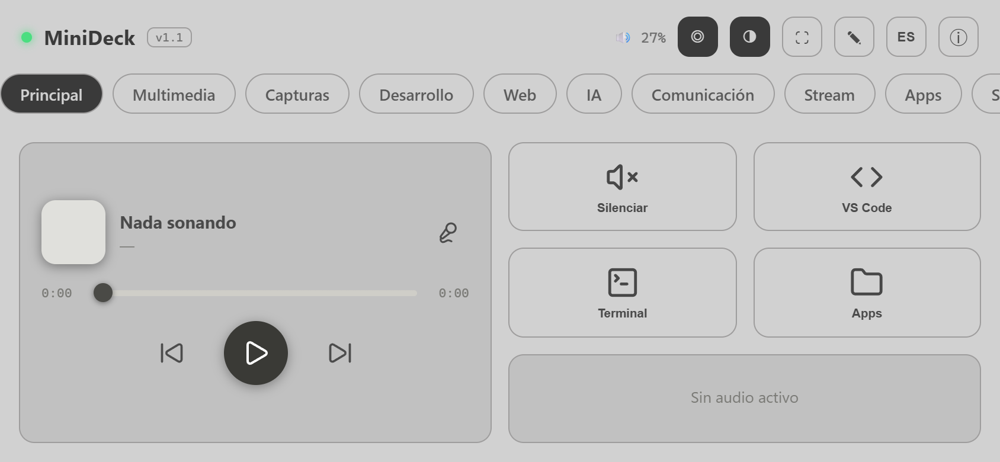

# MiniDeck

[English](README.md) · **Español** · 🌐 **[minideck.samons.co](https://minideck.samons.co)**

[](https://minideck.samons.co)
[](https://github.com/SamonsLol/minideck/actions/workflows/ci.yml)
[](LICENSE)


<a href="https://www.buymeacoffee.com/samons" target="_blank"></a>

Convierte tu móvil en un **Stream Deck** para tu PC o Mac. Sin app que instalar en el teléfono: es una PWA que abres en el navegador. El servidor es Python (FastAPI + WebSocket) y el frontend es HTML/CSS/JS puro, sin build.

Se aceptan issues y PRs en español o en inglés.

> **Míralo en acción:** la web **[minideck.samons.co](https://minideck.samons.co)** está hecha como la propia app: toca las teclas, activa los botones con estado y cambia de tema.

<p align="center">
  
</p>
<p align="center">
  
  
</p>
<p align="center">
  
  
</p>

## Qué hace

- **Botones** para atajos de teclado, abrir apps/webs, comandos, macros, webhooks (n8n, Home Assistant…), apagar/bloquear, etc.
- **Pulsación larga**: una segunda acción por botón (p. ej. toque = cancelar apagado, mantener = apagar en 60 s).
- **Carpetas**: un botón puede abrir otra página, y `back` vuelve.
- **Botones con estado**: icono, color y texto cambian según el estado en vivo (OBS grabando, Discord silenciado, una luz de Home Assistant encendida…).
- **Widgets en vivo**: volumen, mezclador por app (Windows), *Now Playing* con carátula, Discord (mute/sordina y quién habla), CPU/RAM, clima, Git, Docker, **OBS Studio** y **Home Assistant**.
- **El móvil como webcam**: transmite la cámara del teléfono al PC y úsala en OBS, Zoom, Meet o Discord ([cómo](#el-móvil-como-webcam)).
- **Editor visual** desde el propio móvil: páginas, iconos (Lucide), colores, arrastrar y soltar, **deshacer** e **importar/exportar** decks.
- **Funciona sin internet en tu red local**: el servidor guarda los iconos en caché tras el primer uso.
- Interfaz en **español e inglés** (botón **ES/EN** de la barra superior).
- **Funciona sin JavaScript**: `/basic` es una versión renderizada en el servidor con enlaces y formularios normales (usar el deck, carpetas, pulsación larga, sliders, OBS, Home Assistant y un editor completo del deck). Los navegadores sin JS llegan ahí solos; JavaScript solo añade el tiempo real, arrastrar y soltar y las animaciones.
- **Plugins** en Python + JS, y widgets personalizados desde el Panel de Control (`/panel.html`).
- **Emparejamiento seguro** por QR: nadie más en tu red puede controlar tu equipo.

## Instalación

### Opción 1: descargar (sin Python)

Descarga la última versión desde la [**web**](https://minideck.samons.co/#descargar) o desde [**Releases**](https://github.com/SamonsLol/minideck/releases):

- **Windows:** `MiniDeck-…-windows.zip` → descomprime → ejecuta `MiniDeck.exe`. Aparece un icono en la bandeja: clic derecho → *Mostrar QR*.
- **macOS:** `MiniDeck-…-macos.dmg` → arrastra a Aplicaciones. La primera vez: clic derecho → *Abrir* (la app no está notarizada). Permisos en [README_MAC.md](README_MAC.md).

### Opción 2: pipx

```bash
pipx install git+https://github.com/SamonsLol/minideck.git
minideck            # o: minideck --port 9000
minideck-tray       # Windows/Linux: icono de bandeja en vez de consola
```

### Opción 3: desde el código

```bash
git clone https://github.com/SamonsLol/minideck.git
cd minideck
python -m venv .venv
# Windows:        .venv\Scripts\activate
# macOS / Linux:  source .venv/bin/activate
pip install -r requirements.txt
cd server
python main.py
```

En Windows también puedes hacer doble clic en `MiniDeck.bat` (sin consola, con icono en la bandeja).

### Emparejar el móvil

1. En el equipo abre **http://localhost:8765/qr**.
2. Escanea el QR con la cámara del móvil. Se abre MiniDeck ya **emparejado**.
3. *Compartir → Añadir a pantalla de inicio* para usarlo a pantalla completa.

La app instalada en la pantalla de inicio no comparte almacenamiento con el navegador (sobre todo en iPhone), así que la primera vez pide emparejar otra vez: toca **📷 Escanear QR** y apunta a la pantalla del equipo (por HTTP hace una foto del QR; con HTTPS lo escanea en vivo), o escribe el código que aparece bajo el QR.

El móvil y el equipo deben estar en la **misma red WiFi**. En Windows, cuando el Firewall pregunte, permite Python/MiniDeck en **redes privadas**.

## Seguridad

MiniDeck puede ejecutar comandos en tu equipo, así que:

- Todas las peticiones a `/api` y `/ws` exigen un **token de emparejamiento** (se genera solo la primera vez y se guarda en `auth_token`, en la carpeta de config).
- El QR y el token solo se muestran **desde el propio equipo** (`localhost`).
- **No compartas el QR ni el código.** Para revocar todos los dispositivos, borra el archivo `auth_token` y reinicia: se generará uno nuevo.
- No expongas el puerto 8765 a Internet (nada de *port forwarding*). Si necesitas acceso remoto, usa una VPN como Tailscale o WireGuard.

Más detalles y cómo reportar vulnerabilidades: [SECURITY.md](SECURITY.md).

## Configurar el deck

El deck vive en `deck.json`:

| Modo | Ubicación |
|---|---|
| Desde el código (`python main.py`) | `server/config/deck.json` |
| App empaquetada o pipx | Windows `%APPDATA%\MiniDeck\` · macOS `~/Library/Application Support/MiniDeck/` · Linux `~/.config/minideck/` |

La primera vez se crea a partir del deck por defecto de tu sistema (`server/config/deck.default.<windows|macos|linux>.json`). Lo más cómodo es editarlo desde el móvil con el botón ✎. También puedes editar el JSON a mano: al guardar, todos los clientes se actualizan solos. Cada guardado deja una copia (las últimas 30, en `backups/`), así que **↶ Deshacer** del editor puede volver atrás.

```json
{
  "id": "grabar",
  "label": "Grabar",
  "icon": "lucide:circle",
  "color": "#8a93a3",
  "action": "obs_record_toggle",
  "params": {},
  "longAction": "obs_replay_save",
  "longParams": {},
  "when": { "key": "obs.recording", "icon": "lucide:circle-stop",
            "color": "#f87171", "label": "Grabando" }
}
```

| Campo | Significado |
|---|---|
| `action` / `params` | Qué hace un toque. |
| `longAction` / `longParams` | Opcional: qué hace la pulsación larga (~0,5 s). |
| `when` | Opcional: aspecto mientras un valor del estado en vivo sea verdadero. `key` es una ruta en el estado (`obs.recording`, `discord.mute`, `ha.entities.light.salon.state`), `equals` compara con un valor; `icon`, `color` y `label` sustituyen a los del botón. |
| `"action": "page"` | Carpeta: `{"page": "<id de página>"}` abre esa página, `{"page": "back"}` vuelve. |
| `w` / `h` | Ancho/alto en celdas (`"w": "full"` = fila completa). |

## Acciones incluidas

| Acción | Params | Plataformas |
|---|---|---|
| `hotkey` | `{"keys": "ctrl+shift+m"}` | todas |
| `type_text` | `{"text": "hola"}` | todas |
| `launch` | `{"path": "..."}` o `{"app": "code"}` | todas |
| `command` | `{"cmd": "...", "shell": "powershell"}` | todas |
| `website` | `{"url": "https://..."}` | todas |
| `http_request` | `{"url", "method", "body", "headers"}` | todas |
| `now_playing` | `{"cmd": "play_pause" \| "next" \| "previous" \| "seek", "position": 90}` | Win, Mac |
| `volume_set` / `volume_change` / `volume_mute` | `{"level": 50}` / `{"delta": 5}` / `{}` | Win, Mac |
| `mixer_set` / `mixer_mute` | `{"app": "chrome.exe", "level": 40}` | Win |
| `discord_mute` / `discord_deafen` | `{}` | todas |
| `obs_scene`, `obs_record_toggle`, `obs_stream_toggle`, `obs_mute_toggle`, `obs_replay_save`… | ver [plugin OBS](server/plugins/obs/README.md) | todas |
| `ha_toggle`, `ha_scene`, `ha_service` | ver [plugin Home Assistant](server/plugins/homeassistant/README.md) | todas |
| `lock` | `{}` | todas |
| `power` | `{"mode": "shutdown" \| "restart" \| "sleep" \| "cancel"}` | todas |
| `kill_process` | `{"name": "app.exe"}` | todas |
| `mouse_click` / `mouse_move` | `{"x": 100, "y": 200}` | todas |
| `macro` | `{"steps": [{"action": ..., "params": ...}, {"delay_ms": 500}]}` | todas |
| `screenshot`, `show_desktop`, `shortcut`, `clipboard_copy`, `ocr_capture`, `audio_output`… | ver código | Mac |

Los parámetros se validan antes de ejecutar, así que un error se ve claro en el móvil. Cada acción tiene un tiempo máximo (30 s por defecto), para que una acción colgada no deje el móvil esperando. Al elegir una acción, el editor rellena una plantilla de parámetros. La lista exacta de tu equipo: `GET /api/actions/schema`.

Discord requiere crear una app en el portal de desarrolladores: instrucciones al principio de [server/actions/discord_rpc.py](server/actions/discord_rpc.py) y plantilla en `server/config/discord.example.json`.

## El móvil como webcam

Añade el widget **Webcam** (viene en la página *Stream* por defecto), tócalo en el móvil y pulsa **Transmitir al PC**. El PC recibe el vídeo en:

| URL (en el PC) | Uso |
|---|---|
| `http://localhost:8765/phonecam/view` | OBS → **Fuente de navegador** (1280×720 o 1920×1080) → **Iniciar cámara virtual**. Zoom, Meet, Teams y Discord la ven como una webcam más. |
| `http://localhost:8765/phonecam/stream.mjpg` | flujo MJPEG para programas que lo acepten (VLC, etc.) |
| `http://localhost:8765/phonecam/snapshot.jpg` | último fotograma |

Desde el móvil eliges cámara frontal/trasera, 480p/720p/1080p y 15/24/30 fps; la pantalla no se apaga mientras transmite. Solo puede transmitir un dispositivo emparejado, y la imagen solo se ve desde el propio PC (o con el token). Solo vídeo, sin audio.

**Los navegadores solo dejan usar la cámara por HTTPS** (o en `localhost`), así que elige una opción:

- **HTTPS en tu red:** crea un certificado con [mkcert](https://github.com/FiloSottile/mkcert) (`winget install FiloSottile.mkcert` / `brew install mkcert`), p. ej. `mkcert -cert-file cert.pem -key-file key.pem 192.168.1.20 localhost`, copia los dos archivos a la carpeta `certs/` dentro de la carpeta de datos de MiniDeck y reinicia (en macOS `build/make_cert.command` lo hace por ti). Instala la CA raíz de mkcert en el móvil para que confíe en él.
- **Android por USB, sin certificado:** `adb reverse tcp:8765 tcp:8765` y abre `http://localhost:8765` en el móvil.

Opcional, sin OBS: `pip install pyvirtualcam numpy Pillow` (más el driver de cámara virtual de OBS, o v4l2loopback en Linux) y MiniDeck envía los fotogramas directamente a la cámara virtual del sistema.

## Plugins

Añade acciones, datos en vivo y widgets sin tocar el código de MiniDeck:

```
%APPDATA%\MiniDeck\plugins\mi_plugin\     (o ~/Library/Application Support/MiniDeck/plugins/…)
├── plugin.json   ← nombre, versión, plataformas, dependencias, ajustes
├── plugin.py     ← @action("mi_plugin_hacer")
├── widget.js     ← MiniDeck.registerWidget("mi_plugin", {...})
└── widget.css
```

```python
from actions import action

@action("mi_plugin_hacer", schema={"nombre": {"type": "str", "required": True}})
def hacer(params: dict):
    return {"message": f"Hola {params['nombre']}"}
```

Guía completa: **[docs/PLUGINS.md](docs/PLUGINS.md)** · Plantilla: [examples/plugins/hello](examples/plugins/hello) · Índice de la comunidad: [docs/PLUGIN_INDEX.md](docs/PLUGIN_INDEX.md)

## Opciones del servidor

| Opción | Por defecto | Para qué |
|---|---|---|
| `--port` / `MINIDECK_PORT` | `8765` | Puerto |
| `--host` / `MINIDECK_HOST` | `0.0.0.0` | Interfaz (usa `127.0.0.1` para solo local) |
| `MINIDECK_TOKEN` | aleatorio | Fijar el token (p. ej. el mismo en varios equipos) |
| `MINIDECK_CONFIG_DIR` | ver arriba | Carpeta de `deck.json`, copias, token y `discord.json` |
| `MINIDECK_PLUGINS_DIR` | `<datos>/plugins` | Carpeta de plugins de usuario |
| `MINIDECK_LOG_DIR` | `<datos>/logs` | Log con rotación (`minideck.log`, máx. ~3 MB). También en `GET /api/logs` |
| `MINIDECK_ICON_CACHE` | `<datos>/icon-cache` | Iconos descargados |
| `MINIDECK_NO_AUTH=1` | — | Desactiva el token. **No recomendado.** |

## Estructura

```
minideck/
├── server/
│   ├── main.py            # FastAPI + WebSocket + rutas
│   ├── auth.py            # token de emparejamiento
│   ├── paths.py           # rutas por sistema operativo
│   ├── icons.py           # proxy de iconos con caché en disco
│   ├── actions/           # acciones incluidas (un módulo por plataforma)
│   ├── plugins/           # plugins incluidos (obs, homeassistant, sysmon, clock, indicators)
│   ├── config/            # decks por defecto por sistema y plantillas
│   ├── app_tray.py        # icono de bandeja (Windows/Linux, punto de entrada del .exe)
│   ├── app_menubar.py     # app de barra de menú (macOS)
│   └── run.ps1            # lanzador con bandeja sin pystray (Windows)
├── frontend/              # PWA (HTML/CSS/JS puro, sin build; i18n.js = traducciones)
├── packaging/             # lanzador para pip/pipx
├── examples/plugins/      # plantilla de plugin
├── docs/                  # guía de plugins y capturas
├── build/                 # specs de PyInstaller (.exe de Windows, .app de macOS), DMG, certificados
└── tests/                 # tests de servidor, plugins, empaquetado e interfaz en navegador
```

## Contribuir

¡Bienvenido! Lee [CONTRIBUTING.md](CONTRIBUTING.md). Para desarrollo:

```bash
pip install -r requirements-dev.txt
python -m playwright install chromium   # para los tests de interfaz
pytest
ruff check server tests examples packaging
```

Para publicar una versión: `git tag v1.1.0 && git push origin v1.1.0`. GitHub Actions construye el `.zip` de Windows, el `.dmg` de macOS y el paquete de Python, y los adjunta a la release.

## Apoyar el proyecto

MiniDeck es gratis y lo seguirá siendo. Si te ahorra tiempo, puedes [invitarme a un café](https://www.buymeacoffee.com/samons) ☕

## Licencia

Copyright © 2026 Samons

MiniDeck es software libre: puedes redistribuirlo y/o modificarlo bajo los términos de la **GNU Affero General Public License** publicada por la Free Software Foundation, ya sea la versión 3 o (a tu elección) cualquier versión posterior (`AGPL-3.0-or-later`). Se distribuye SIN NINGUNA GARANTÍA. Texto completo en [LICENSE](LICENSE).

En resumen: puedes usarlo, modificarlo y compartirlo libremente, pero si distribuyes una versión modificada **o la ofreces a otras personas a través de la red**, debes publicar su código fuente bajo la misma licencia.
