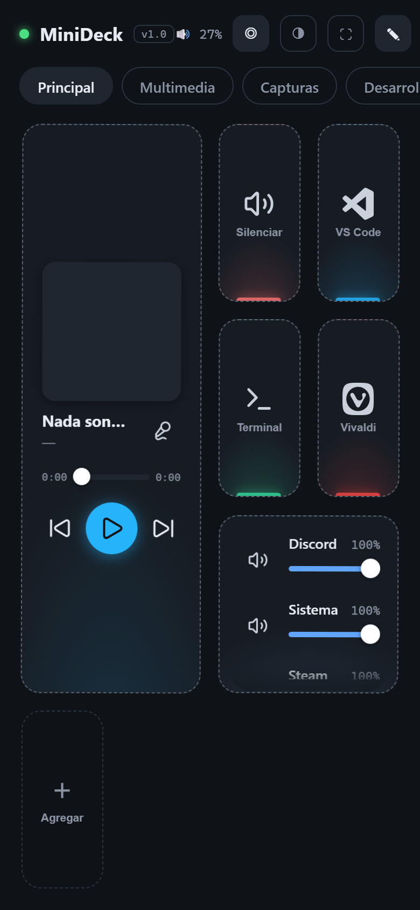
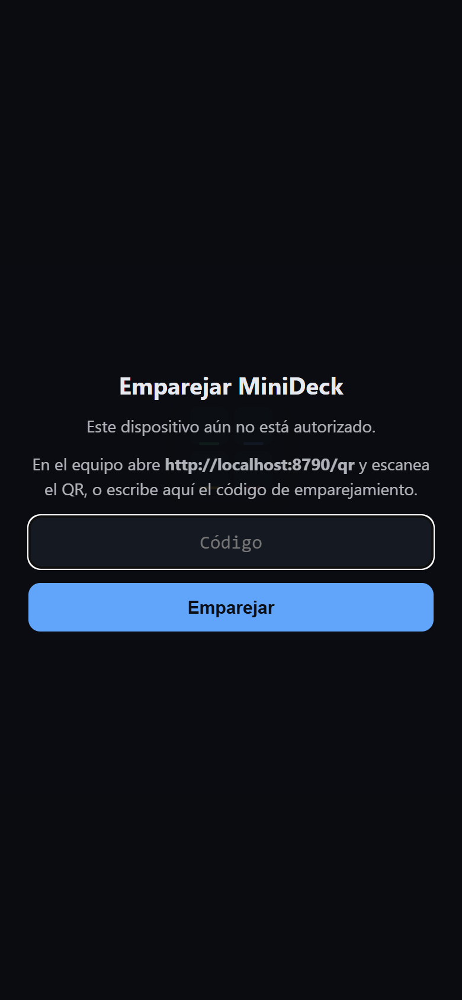
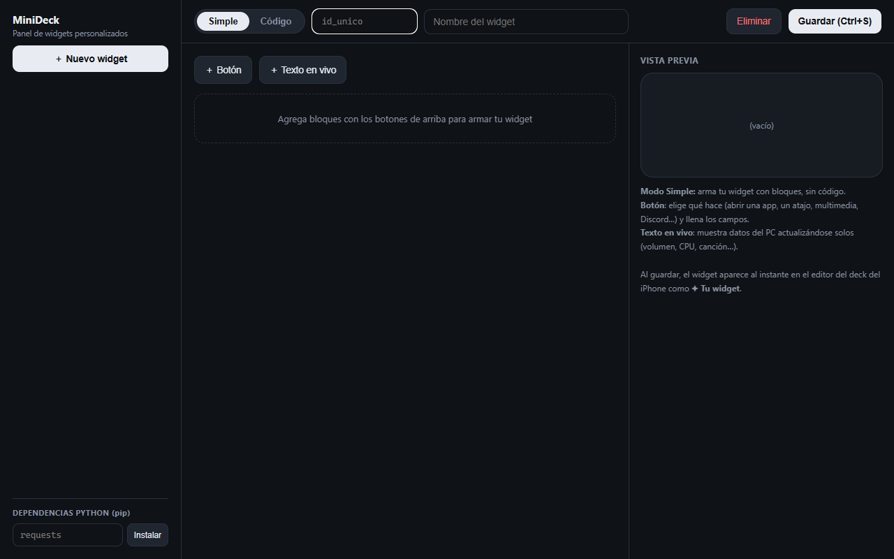

# MiniDeck

**English** · [Español](README.es.md)

[](https://github.com/SamonsLol/minideck/actions/workflows/ci.yml)
[](LICENSE)


Turn your phone into a **Stream Deck** for your PC or Mac. There's no app to install on the phone: it's a PWA you open in the browser. The server is Python (FastAPI + WebSocket) and the frontend is plain HTML/CSS/JS with no build step.

Issues and PRs are welcome in English or Spanish.

<p align="center">
  
  
  
  
</p>
<p align="center">
  
  
</p>

## Features

- **Buttons** for keyboard shortcuts, opening apps and websites, shell commands, macros, webhooks (n8n, Home Assistant…), shutdown/lock, and more.
- **Live widgets**: volume, per-app mixer (Windows), *Now Playing* with album art, Discord (mute/deafen and who's speaking), CPU/RAM, weather, Git, Docker…
- **Visual editor** right on the phone: pages, icons (Lucide), colors, drag and drop.
- **Per-app profiles** (macOS): switch pages automatically based on the active app.
- **Plugins** in Python + JS, plus custom widgets built in the Control Panel (`/panel.html`).
- **Secure QR pairing**: nobody else on your network can control your computer.

## Quick start

Requirements: Python 3.10+ and your phone on the **same Wi-Fi network** as the computer.

```bash
git clone https://github.com/SamonsLol/minideck.git
cd minideck
python -m venv .venv
# Windows:        .venv\Scripts\activate
# macOS / Linux:  source .venv/bin/activate
pip install -r requirements.txt
cd server
python main.py
```

The console shows something like this (the messages are in Spanish):

```
  MiniDeck 1.0.0 corriendo
  En este equipo:  http://localhost:8765
  QR para el móvil: http://localhost:8765/qr
  Desde el móvil:  http://192.168.1.50:8765  (código: …)
```

1. On the computer, open **http://localhost:8765/qr**.
2. Scan the QR code with your phone's camera. MiniDeck opens already **paired**.
3. Use *Share → Add to Home Screen* to run it full screen.

**Windows:** double-click `MiniDeck.bat` to start it with no console window and a tray icon (right-click → Show QR / Quit). The first time, allow Python access to **private networks** in Windows Firewall.

**macOS:** see [README_MAC.md](README_MAC.md) (in Spanish) for Accessibility permissions, the menu bar `.app`, and HTTPS for Android.

## Security

MiniDeck can run commands on your computer, so:

- Every request to `/api` and `/ws` requires a **pairing token**. It's generated on first run and stored in `auth_token` in the config folder.
- The QR code and token are only shown **on the computer itself** (`localhost`).
- **Don't share the QR code or the pairing code.** To revoke every paired device, delete `auth_token` and restart; a new one is generated.
- Never expose port 8765 to the internet (no port forwarding). For remote access, use a VPN such as Tailscale or WireGuard.

More details and how to report vulnerabilities: [SECURITY.md](SECURITY.md).

## Configuring the deck

The deck lives in `deck.json`:

| Mode | Location |
|---|---|
| From source (`python main.py`) | `server/config/deck.json` |
| Packaged app | Windows `%APPDATA%\MiniDeck\` · macOS `~/Library/Application Support/MiniDeck/` · Linux `~/.config/minideck/` |

On first run it's created from `server/config/deck.default.json`. The easiest way to edit it is from the phone with the ✎ button, but you can also edit the JSON by hand: when you save, every connected client updates automatically.

```json
{
  "id": "unique_btn",
  "label": "My button",
  "icon": "lucide:gamepad-2",
  "color": "#60a5fa",
  "action": "hotkey",
  "params": { "keys": "ctrl+shift+m" }
}
```

## Built-in actions

| Action | Params | Platforms |
|---|---|---|
| `hotkey` | `{"keys": "ctrl+shift+m"}` | Win, Mac |
| `type_text` | `{"text": "hello"}` | Win, Mac |
| `launch` | `{"path": "..."}` · Mac: `{"app": "Safari"}` | all |
| `command` | `{"cmd": "...", "shell": "powershell"}` | all |
| `website` | `{"url": "https://..."}` | all |
| `http_request` | `{"url", "method", "body", "headers"}` | all |
| `now_playing` | `{"cmd": "play_pause" \| "next" \| "previous" \| "seek", "position": 90}` | Win, Mac |
| `volume_set` / `volume_change` / `volume_mute` | `{"level": 50}` / `{"delta": 5}` / `{}` | Win, Mac |
| `mixer_set` / `mixer_mute` | `{"app": "chrome.exe", "level": 40}` | Win |
| `discord_mute` / `discord_deafen` | `{}` | Win, Mac, Linux |
| `lock` | `{}` | all |
| `power` | `{"mode": "shutdown" \| "restart" \| "sleep" \| "cancel"}` | all |
| `kill_process` | `{"name": "app.exe"}` | all |
| `mouse_click` / `mouse_move` | `{"x": 100, "y": 200}` | all |
| `macro` | `{"steps": [{"action": ..., "params": ...}, {"delay_ms": 500}]}` | all |
| `screenshot`, `show_desktop`, `shortcut`, `clipboard_copy`, `ocr_capture`, `audio_output`… | see source | Mac |

The exact list available on your machine: `GET /api/actions`.

Discord needs an app created in the Discord Developer Portal: see the instructions at the top of [server/actions/discord_rpc.py](server/actions/discord_rpc.py) and the template in `server/config/discord.example.json`.

## Plugins

Add actions, live data, and widgets without touching MiniDeck's code:

```
%APPDATA%\MiniDeck\plugins\my_plugin\     (or ~/Library/Application Support/MiniDeck/plugins/…)
├── plugin.json   ← name, version, platforms, dependencies, settings
├── plugin.py     ← @action("my_plugin_do")
├── widget.js     ← MiniDeck.registerWidget("my_plugin", {...})
└── widget.css
```

```python
from actions import action

@action("my_plugin_do")
def do(params: dict):
    return {"message": "Done"}
```

Full guide (in Spanish): **[docs/PLUGINS.md](docs/PLUGINS.md)** · Template: [examples/plugins/hello](examples/plugins/hello) · Community index: [docs/PLUGIN_INDEX.md](docs/PLUGIN_INDEX.md)

## Server options

| Option | Default | Purpose |
|---|---|---|
| `--port` / `MINIDECK_PORT` | `8765` | Port |
| `--host` / `MINIDECK_HOST` | `0.0.0.0` | Interface (use `127.0.0.1` for local only) |
| `MINIDECK_TOKEN` | random | Fixed token (e.g. the same one on several machines) |
| `MINIDECK_CONFIG_DIR` | see above | Folder for `deck.json`, the token, and `discord.json` |
| `MINIDECK_PLUGINS_DIR` | `<data>/plugins` | User plugins folder |
| `MINIDECK_NO_AUTH=1` | — | Disables the token. **Not recommended.** |

## Project layout

```
minideck/
├── server/
│   ├── main.py            # FastAPI + WebSocket + routes
│   ├── auth.py            # pairing token
│   ├── paths.py           # per-OS paths
│   ├── actions/           # built-in actions (one module per platform)
│   ├── plugins/           # bundled plugins (sysmon, clock, indicators)
│   ├── config/            # deck.default.json and templates
│   ├── app_menubar.py     # menu bar app (macOS)
│   └── run.ps1            # tray-icon launcher (Windows)
├── frontend/              # PWA (plain HTML/CSS/JS, no build)
├── examples/plugins/      # plugin template
├── docs/                  # plugin guide
├── build/                 # macOS packaging (PyInstaller, DMG, certificates)
└── tests/
```

## Contributing

Welcome aboard! Read [CONTRIBUTING.md](CONTRIBUTING.md). For development:

```bash
pip install -r requirements-dev.txt
pytest
ruff check server tests
```

## License

Copyright © 2026 Samons

MiniDeck is free software: you can redistribute it and/or modify it under the terms of the **GNU Affero General Public License** as published by the Free Software Foundation, either version 3 of the License, or (at your option) any later version (`AGPL-3.0-or-later`). It is distributed WITHOUT ANY WARRANTY. Full text in [LICENSE](LICENSE).

In short: you're free to use, modify, and share it, but if you distribute a modified version **or make it available to others over a network**, you must publish its source code under the same license.
